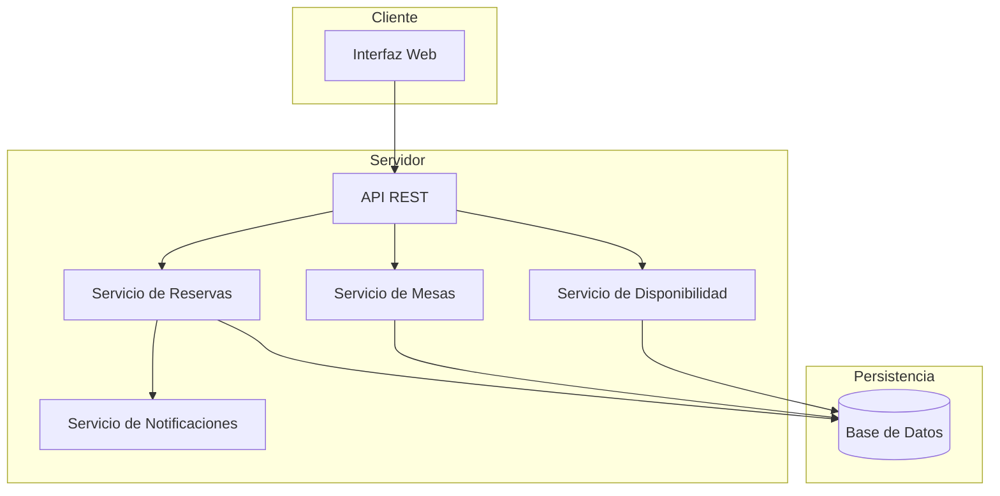
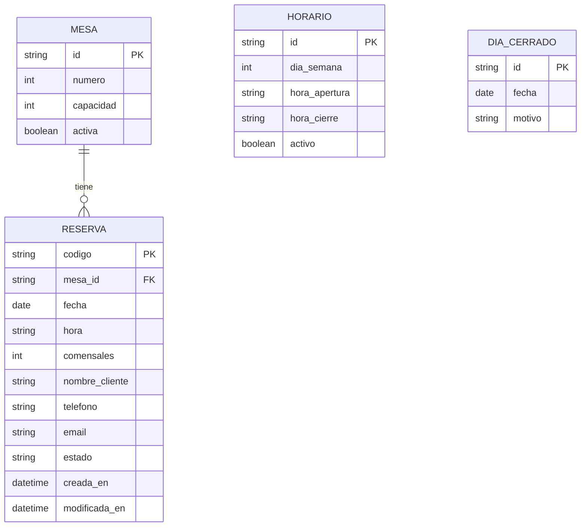

# Documento de Diseño

## Descripción General

Sistema de reservas para el restaurante "El Rinconcito de Anaga" que permite a los clientes realizar, consultar, modificar y cancelar reservas de mesas, mientras que los administradores pueden gestionar las mesas, horarios y visualizar el panel de reservas.

El sistema se implementará como una aplicación web con una arquitectura cliente-servidor, utilizando una API REST para la comunicación y almacenamiento persistente en base de datos.

## Arquitectura



### Capas del Sistema

1. **Capa de Presentación**: Interfaz web responsive para clientes y administradores
2. **Capa de API**: Endpoints REST para todas las operaciones
3. **Capa de Servicios**: Lógica de negocio para reservas, mesas y disponibilidad
4. **Capa de Persistencia**: Almacenamiento en base de datos

## Componentes e Interfaces

### API de Reservas

```
POST   /api/reservas              - Crear nueva reserva
GET    /api/reservas/:codigo      - Consultar reserva por código
PUT    /api/reservas/:codigo      - Modificar reserva existente
DELETE /api/reservas/:codigo      - Cancelar reserva
GET    /api/reservas              - Listar reservas (admin, con filtros)
```

### API de Mesas

```
GET    /api/mesas                 - Listar todas las mesas
GET    /api/mesas/disponibles     - Consultar mesas disponibles (fecha, hora, comensales)
POST   /api/mesas                 - Crear mesa (admin)
PUT    /api/mesas/:id             - Modificar mesa (admin)
DELETE /api/mesas/:id             - Eliminar mesa (admin)
```

### API de Disponibilidad

```
GET    /api/disponibilidad/:fecha - Consultar disponibilidad de una fecha
PUT    /api/disponibilidad/horario - Configurar horario de apertura (admin)
POST   /api/disponibilidad/cierre  - Marcar día como cerrado (admin)
```

### Interfaces de Servicio

```typescript
interface ReservaService {
  crearReserva(datos: DatosReserva): Promise<Reserva>;
  consultarReserva(codigo: string): Promise<Reserva | null>;
  modificarReserva(codigo: string, cambios: CambiosReserva): Promise<Reserva>;
  cancelarReserva(codigo: string): Promise<ResultadoCancelacion>;
  listarReservas(filtros: FiltrosReserva): Promise<Reserva[]>;
}

interface MesaService {
  listarMesas(): Promise<Mesa[]>;
  consultarDisponibles(fecha: Date, hora: string, comensales: number): Promise<Mesa[]>;
  crearMesa(datos: DatosMesa): Promise<Mesa>;
  modificarMesa(id: string, cambios: CambiosMesa): Promise<Mesa>;
  eliminarMesa(id: string): Promise<ResultadoEliminacion>;
}

interface DisponibilidadService {
  consultarDisponibilidad(fecha: Date): Promise<Disponibilidad>;
  configurarHorario(horario: Horario): Promise<void>;
  marcarDiaCerrado(fecha: Date): Promise<void>;
}
```

## Modelos de Datos

### Diagrama Entidad-Relación



### Estructuras de Datos

```typescript
interface Mesa {
  id: string;
  numero: number;
  capacidad: number;
  activa: boolean;
}

interface Reserva {
  codigo: string;
  mesaId: string;
  fecha: Date;
  hora: string;
  comensales: number;
  cliente: DatosCliente;
  estado: EstadoReserva;
  creadaEn: Date;
  modificadaEn: Date;
}

interface DatosCliente {
  nombre: string;
  telefono: string;
  email: string;
}

type EstadoReserva = 'confirmada' | 'cancelada' | 'completada' | 'no_show';

interface Horario {
  diaSemana: number; // 0-6 (domingo-sábado)
  horaApertura: string; // "HH:mm"
  horaCierre: string; // "HH:mm"
  activo: boolean;
}

interface DiaCerrado {
  id: string;
  fecha: Date;
  motivo: string;
}

interface DatosReserva {
  fecha: Date;
  hora: string;
  comensales: number;
  cliente: DatosCliente;
  mesaId?: string; // Opcional, se puede asignar automáticamente
}

interface FiltrosReserva {
  fecha?: Date;
  estado?: EstadoReserva;
  mesaId?: string;
}
```

### Generación de Código de Reserva

El código de reserva será un identificador único de 8 caracteres alfanuméricos generado al crear la reserva, facilitando su comunicación al cliente.

```typescript
function generarCodigoReserva(): string {
  const caracteres = 'ABCDEFGHJKLMNPQRSTUVWXYZ23456789';
  let codigo = '';
  for (let i = 0; i < 8; i++) {
    codigo += caracteres.charAt(Math.floor(Math.random() * caracteres.length));
  }
  return codigo;
}
```


## Propiedades de Correctitud

*Una propiedad es una característica o comportamiento que debe mantenerse verdadero en todas las ejecuciones válidas del sistema. Las propiedades sirven como puente entre las especificaciones legibles por humanos y las garantías de correctitud verificables por máquinas.*

### Property 1: Mesas disponibles cumplen capacidad requerida

*Para cualquier* consulta de disponibilidad con un número de comensales N, todas las mesas devueltas como disponibles deben tener una capacidad >= N.

**Validates: Requirements 1.1**

### Property 2: Round-trip de reserva

*Para cualquier* reserva creada con datos válidos, al consultar esa reserva usando su código, el sistema debe devolver los mismos datos de fecha, hora, comensales y cliente que fueron proporcionados al crearla.

**Validates: Requirements 1.2, 2.1, 2.3, 8.1**

### Property 3: Conflicto de reservas

*Para cualquier* mesa M y franja horaria T, si existe una reserva confirmada para M en T, entonces cualquier intento de crear otra reserva para M en T debe ser rechazado.

**Validates: Requirements 1.3**

### Property 4: Validación de datos de cliente

*Para cualquier* intento de crear una reserva con datos de cliente incompletos (nombre, teléfono o email faltantes), el sistema debe rechazar la reserva e indicar los campos faltantes.

**Validates: Requirements 1.4**

### Property 5: Validación de fechas pasadas

*Para cualquier* fecha anterior a la fecha actual, el sistema debe rechazar cualquier intento de crear una reserva para esa fecha.

**Validates: Requirements 1.5**

### Property 6: Código inexistente retorna error

*Para cualquier* código de reserva que no existe en el sistema, la consulta debe retornar un error indicando que la reserva no fue encontrada.

**Validates: Requirements 2.2**

### Property 7: Modificación de reserva preserva integridad

*Para cualquier* reserva existente, al modificarla con una nueva configuración disponible (fecha, hora, comensales), la reserva debe actualizarse y al consultarla debe reflejar los nuevos valores.

**Validates: Requirements 3.1, 3.2, 3.3**

### Property 8: Cancelación libera mesa

*Para cualquier* reserva confirmada, al cancelarla, la mesa asociada debe aparecer como disponible para esa misma franja horaria en consultas posteriores.

**Validates: Requirements 4.1, 4.2**

### Property 9: Gestión de mesas con reservas

*Para cualquier* mesa con reservas futuras, el sistema debe rechazar su eliminación. *Para cualquier* mesa sin reservas futuras, el sistema debe permitir su eliminación.

**Validates: Requirements 5.1, 5.2, 5.3, 5.4**

### Property 10: Restricciones de disponibilidad

*Para cualquier* día marcado como cerrado o *para cualquier* hora fuera del horario configurado, el sistema debe rechazar la creación de reservas.

**Validates: Requirements 6.1, 6.2**

### Property 11: Filtrado y ordenamiento de reservas

*Para cualquier* consulta de reservas con filtros de fecha y/o estado, todas las reservas devueltas deben cumplir con los filtros especificados y estar ordenadas por hora ascendente.

**Validates: Requirements 7.1, 7.2, 7.3, 7.4**

## Manejo de Errores

### Códigos de Error

| Código | Descripción | Escenario |
|--------|-------------|-----------|
| RESERVA_NO_ENCONTRADA | La reserva con el código especificado no existe | Consulta/modificación/cancelación con código inválido |
| MESA_NO_DISPONIBLE | La mesa no está disponible en la franja solicitada | Intento de reservar mesa ocupada |
| FECHA_INVALIDA | La fecha es anterior a la fecha actual | Reserva con fecha pasada |
| DATOS_INCOMPLETOS | Faltan campos requeridos en los datos del cliente | Reserva sin nombre/teléfono/email |
| FUERA_DE_HORARIO | La hora solicitada está fuera del horario de apertura | Reserva fuera de horario |
| DIA_CERRADO | El restaurante está cerrado en la fecha solicitada | Reserva en día cerrado |
| MESA_CON_RESERVAS | La mesa tiene reservas futuras y no puede eliminarse | Intento de eliminar mesa con reservas |
| MODIFICACION_TARDIA | La modificación se solicita con menos de 2 horas de anticipación | Modificación tardía |
| CAPACIDAD_INSUFICIENTE | No hay mesas disponibles para el número de comensales | Sin mesas con capacidad suficiente |

### Respuestas de Error

```typescript
interface ErrorResponse {
  codigo: string;
  mensaje: string;
  detalles?: Record<string, string>;
  alternativas?: Mesa[]; // Para errores de disponibilidad
}
```

### Estrategia de Recuperación

1. **Errores de validación**: Devolver mensaje claro con campos faltantes/inválidos
2. **Errores de disponibilidad**: Sugerir alternativas (otras mesas, otras horas)
3. **Errores de sistema**: Log del error, respuesta genérica al usuario, alerta al administrador

## Estrategia de Testing

### Enfoque Dual de Testing

El sistema utilizará dos tipos complementarios de tests:

1. **Tests Unitarios**: Para ejemplos específicos, casos edge y condiciones de error
2. **Tests de Propiedades (Property-Based Testing)**: Para verificar propiedades universales con inputs generados

### Configuración de Property-Based Testing

- **Librería**: fast-check (para TypeScript/JavaScript)
- **Iteraciones mínimas**: 100 por cada test de propiedad
- **Formato de tag**: `Feature: reservas-restaurante, Property {N}: {descripción}`

### Tests de Propiedades

Cada propiedad del diseño se implementará como un test de propiedad:

| Propiedad | Test | Generadores |
|-----------|------|-------------|
| Property 1 | Mesas disponibles cumplen capacidad | Generar número de comensales aleatorio |
| Property 2 | Round-trip de reserva | Generar datos de reserva válidos |
| Property 3 | Conflicto de reservas | Generar pares de reservas para misma mesa/hora |
| Property 4 | Validación de datos | Generar datos de cliente con campos faltantes |
| Property 5 | Validación de fechas | Generar fechas pasadas |
| Property 6 | Código inexistente | Generar códigos aleatorios |
| Property 7 | Modificación de reserva | Generar reservas y modificaciones válidas |
| Property 8 | Cancelación libera mesa | Generar reservas para cancelar |
| Property 9 | Gestión de mesas | Generar mesas con/sin reservas |
| Property 10 | Restricciones disponibilidad | Generar fechas/horas fuera de horario |
| Property 11 | Filtrado de reservas | Generar múltiples reservas con diferentes filtros |

### Tests Unitarios

Los tests unitarios cubrirán:

- Casos edge específicos (límites de horario, capacidad exacta)
- Condiciones de error específicas
- Integración entre componentes
- Formato de respuestas de API

### Cobertura de Requisitos

Cada test debe referenciar los requisitos que valida usando el formato:
```
// Requirements: X.Y, X.Z
```
